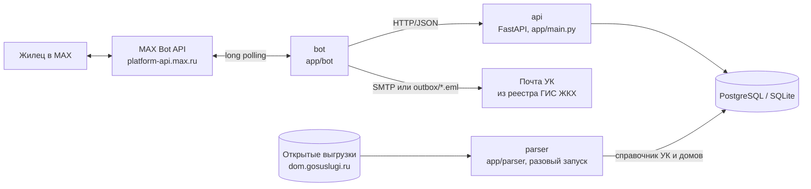

# Домовой — бот в MAX для жильцов многоквартирных домов

Хакатон MAX, трек «Умный город».

**Домовой** — чат-бот в мессенджере MAX. Он помогает жильцу многоквартирного
дома за пару минут отправить обращение в *свою* управляющую компанию, не выясняя,
кто обслуживает дом и куда писать, и показывает плановые отключения воды
и электричества по адресу.

| | |
|---|---|
| Бот в MAX | `<ссылка на бота>` |
| Репозиторий | https://github.com/rp3222079-byte/-hackathon_MAX_grajdanin |
| Проверяемая версия | `<commit hash>` |
| Собственный API | внутренний, наружу не публикуется (см. «Состав и архитектура») |

---

## Назначение

Жилец в ситуации «в подъезде не работает лифт или течёт труба» хочет, чтобы
управляющая компания узнала о проблеме и начала работу. Сейчас он должен сам
найти, какая УК обслуживает дом, отыскать её почту или телефон, составить
письмо в свободной форме, а потом помнить, когда и кому писал.

Домовой сводит это к диалогу из нескольких кнопок:

1. жилец один раз указывает адрес;
2. бот по справочнику ГИС ЖКХ определяет управляющую компанию дома;
3. жилец выбирает тему и описывает проблему;
4. бот формирует письмо с номером обращения, отправляет его на официальную почту
   УК из реестра ГИС ЖКХ и сохраняет обращение в «Моих обращениях».

Дополнительно по основному адресу показываются отключения воды и электричества.

## Основной пользовательский сценарий

```
/start ─► город ─► улица ─► дом ─► квартира (или «-») ─► адрес сохранён
   │
   └─► «Написать обращение» ─► тема (Протечка / Отопление / Лифт / Мусор /
        Подъезд и двор / Другое) ─► текст ─► фото или «Пропустить»
        ─► «Указать контакт» / «Не указывать» ─► проверка ─► «Отправить»
        ─► «Обращение №DM-00001 отправлено в УК «…»»
   │
   └─► «Мои обращения» ─► список с номерами и статусами
```

Прочие пункты меню:

- **Мой адрес** — список адресов, «Добавить адрес».
- **Отключения** — отключения воды и света по основному адресу.
- **Настройки** — какие уведомления об отключениях получать (вода / свет),
  за сколько часов предупреждать, «Отписаться от всех».
- `/start` в любой момент прерывает текущий диалог и возвращает в начало.

## Состав и архитектура



| Компонент | Где | Что делает |
|---|---|---|
| **bot** | `app/bot/` | Long polling MAX Bot API, сценарии диалогов, клавиатуры, отправка письма в УК, раз в минуту проверяет смену статуса обращений и сообщает жильцу |
| **api** | `app/main.py`, `app/routers/` | Внутренний REST API: жильцы, адреса, отключения, обращения, УК. Схема — http://localhost:8000/docs |
| **db** | PostgreSQL 16 (в Docker) или SQLite (локально) | Жильцы, адреса, УК и их дома, отключения, обращения |
| **parser** | `app/parser/` | Разовая сборка справочника УК и домов из открытых выгрузок ГИС ЖКХ |
| **seed** | `app/seed.py` | Загрузка тестового справочника УК и демо-отключений |

Бот не обращается к базе напрямую, только через API: логика данных живёт в одном
месте, а бот остаётся тонким слоем диалогов.

API нужен только боту и не является самостоятельным продуктом для проверки,
поэтому наружу он не публикуется.

Структура кода:

```
app/
  main.py            FastAPI: роутеры, обработка ошибок, /docs, /health
  config.py          настройки из окружения (DATABASE_URL)
  db.py              подключение к БД
  migrations.py      миграции схемы (применяются при старте)
  models.py          таблицы: users, addresses, management_companies,
                     company_houses, outages, outage_notifications, appeals
  schemas.py         схемы запросов и ответов API
  seed.py            тестовые данные
  routers/           users, addresses, outages, appeals, companies
  services/
    addresses.py     нормализация улиц, разбор номеров домов «1-15, 12к2»
    appeals.py       номер обращения, поиск УК по дому
    mailer.py        письмо в УК (SMTP или outbox/)
    matching.py      кого затрагивает отключение
    notifier.py      текст уведомления об отключении
  bot/
    main.py          цикл long polling и проверка статусов обращений
    client.py        клиент MAX Bot API
    api.py           запросы бота к нашему API
    handlers.py      сценарии диалогов
    states.py        состояние диалога жильца
    texts.py         тексты и подписи кнопок
    keyboards.py     inline-клавиатуры
  parser/            парсер ГИС ЖКХ: скачивание, разбор xlsx/csv, склейка по ОГРН
data/companies.csv   тестовый справочник УК
docs/DATABASE.md     описание схемы БД
tests/               автотесты (unittest)
```

## Запуск одной командой (Docker)

Нужны Docker и Docker Compose v2, а также токен бота MAX.

```bash
cp .env.example .env        # Windows: copy .env.example .env
# впишите MAX_BOT_TOKEN в .env
docker compose up --build
```

`docker compose up --build` поднимает все локальные компоненты:

1. `db` — PostgreSQL;
2. `api` — применяет миграции, загружает тестовые данные (`python -m app.seed`,
   повторный запуск дублей не создаёт) и запускает API;
3. `bot` — стартует, когда API прошёл healthcheck, и начинает отвечать в MAX.

Когда в логах появится `Бот запущен: <имя бота>`, откройте бота в MAX
и нажмите «Начать».

### Остановка и повторный запуск

```bash
docker compose stop          # остановить, данные сохраняются
docker compose start         # запустить снова
docker compose down          # остановить и удалить контейнеры (база в volume pgdata сохраняется)
docker compose down -v       # удалить и базу — следующий запуск начнётся с чистых данных
docker compose up --build    # пересобрать после изменения кода
```

### Запуск без Docker (для разработки)

```bash
python -m venv .venv
source .venv/bin/activate          # Windows: .venv\Scripts\activate
pip install -r requirements.txt
cp .env.example .env               # впишите MAX_BOT_TOKEN
python -m app.seed                 # тестовые данные в SQLite domovoy.db
uvicorn app.main:app --port 8000   # терминал 1
python -m app.bot.main             # терминал 2
```

## Переменные окружения

Шаблон — `.env.example`. Рабочие значения хранятся только в `.env`, который не
попадает в репозиторий.

| Переменная | Обязательна | По умолчанию | Назначение |
|---|---|---|---|
| `MAX_BOT_TOKEN` | да | — | Токен бота MAX (business.max.ru → «Чат-боты» → «Интеграция») |
| `MAX_API_BASE_URL` | нет | `https://platform-api.max.ru` | Адрес MAX Bot API |
| `API_BASE_URL` | нет | `http://localhost:8000` | Адрес нашего API для бота. В Docker — `http://api:8000` |
| `DATABASE_URL` | нет | `sqlite:///./domovoy.db` | Строка подключения к БД. В Docker — PostgreSQL сервиса `db` |
| `SMTP_DRY_RUN` | нет | `true` в `.env.example` | `true` — письма не отправляются, а сохраняются в `outbox/*.eml` |
| `SMTP_HOST`, `SMTP_PORT` | при `SMTP_DRY_RUN=false` | —, `587` | SMTP-сервер. Порт 465 — SSL, иначе STARTTLS |
| `SMTP_USER`, `SMTP_PASSWORD` | при `SMTP_DRY_RUN=false` | — | Учётная запись почтового ящика сервиса |
| `SMTP_FROM` | нет | `SMTP_USER` | Адрес отправителя |
| `SMTP_REPLY_TO` | нет | `SMTP_FROM` | Куда УК отвечает на письмо |

## Порты

| Сервис | Порт | Зачем |
|---|---|---|
| `api` | `8000` → `8000` | REST API и документация `/docs`, проверка `/health` |
| `db` | наружу не публикуется | PostgreSQL доступен только внутри сети compose |
| `bot` | нет входящих портов | сам опрашивает MAX (long polling), webhook не нужен |

## Зависимости

Python 3.12. Версии зафиксированы в `requirements.txt`:

- `fastapi`, `uvicorn[standard]` — API;
- `sqlalchemy`, `psycopg[binary]` — работа с БД (PostgreSQL в Docker, SQLite локально);
- `pydantic`, `pydantic-settings`, `email-validator` — схемы и настройки;
- `requests` — клиент MAX Bot API и запросы бота к API;
- `httpx` — скачивание выгрузок ГИС ЖКХ в парсере;
- `beautifulsoup4`, `lxml` — разбор HTML;
- `python-multipart`, `tzdata` — служебные.

## Внешние сервисы и интеграции

| Сервис | Для чего | Статус в MVP |
|---|---|---|
| **MAX Bot API** (`platform-api.max.ru`) | Приём сообщений и нажатий кнопок, ответы жильцу | Реальная интеграция, long polling |
| **Открытые выгрузки ГИС ЖКХ** (dom.gosuslugi.ru) | Справочник УК: название, ОГРН, почта, телефон, сайт; дома под управлением | Реальный парсер (`python -m app.parser`), запускается вручную. Выгрузка домов весит около 3 ГБ, поэтому в Docker она не входит |
| **SMTP** | Отправка обращения на почту УК | Реальная отправка при `SMTP_DRY_RUN=false`. Для проверки по умолчанию включён `outbox/` |
| **Источник отключений** | Плановые отключения воды и света | **Не подключён.** В MVP используются смоделированные демо-отключения (см. ниже) |

Внешний сервис, который нельзя поднять в Docker, — только MAX: для проверки нужен
токен бота и доступ к MAX (мобильное приложение или web.max.ru).

## Работа с данными

**Что откуда берётся:**

| Данные | Источник | Тип |
|---|---|---|
| Жилец | `user_id` из MAX, создаётся при первом сообщении | реальные |
| Адрес жильца | вводит сам жилец | реальные |
| Справочник УК и домов | `data/companies.csv` — **тестовый** (6 УК Новосибирска, адреса почт на `@example.ru`). Настоящий справочник собирается парсером ГИС ЖКХ | тестовые / официальные |
| Отключения | генерирует `app/seed.py`: одно отключение на каждую улицу справочника, время отсчитывается от момента запуска | **смоделированные** |
| Обращения | создаёт бот, номер вида `DM-00001` | реальные |

**Какие данные о жильце хранятся:** `user_id` в MAX, адреса (город, улица, дом,
корпус, квартира — по желанию), настройки уведомлений и обращения. Имя и ник
в MAX попадают в письмо УК только если жилец нажал «Указать контакт».
Обращение сохраняется в базе до отправки письма, поэтому при сбое почты
оно не теряется.

**Как определяется УК.** Улица нормализуется: «ул. Ленина», «улица Ленина»
и «Ленина» считаются одной улицей. Дальше ищется совпадение города, улицы, номера
дома и корпуса в таблице `company_houses`.

**Статусы обращения:** `new` (создано) → `sent` (отправлено в УК) или `failed`
(не отправлено, можно повторить) → `in_progress` (в работе) → `resolved` (решено).
Статусы `in_progress` и `resolved` пока выставляются только через API
(`PATCH /appeals/{number}`). Бот раз в минуту проверяет изменения и присылает
жильцу сообщение.

### Сборка настоящего справочника УК из ГИС ЖКХ

```bash
python -m app.parser --city Новосибирск --out data/nsk          # скачать и собрать csv + json
python -m app.parser --city Новосибирск --out data/nsk --load   # и сразу загрузить в базу
python -m app.parser --load data/nsk/novosibirsk.json           # загрузить готовый файл
```

Дома сопоставляются с организациями по ОГРН. Почта берётся из графы
«Адрес электронной почты» реестра поставщиков информации. Если почты нет,
поле остаётся пустым, и бот честно сообщает, что отправить обращение
некуда. Выгрузки кэшируются в `parser_cache/` и повторно не скачиваются.

> **Внимание.** При загрузке настоящего справочника и `SMTP_DRY_RUN=false`
> обращения уйдут в настоящие управляющие компании. Для демонстрации
> используйте тестовый справочник или `SMTP_DRY_RUN=true`.

## Тестовые данные

Загружаются автоматически при старте `api` в Docker. Вручную:

```bash
python -m app.seed               # справочник УК + демо-отключения
python -m app.seed --companies   # только справочник УК
python -m app.seed --clear       # удалить отключения и отметки об уведомлениях
```

В Docker: `docker compose exec api python -m app.seed --clear`.

Адреса для проверки (город **Новосибирск**):

| Адрес | Что будет |
|---|---|
| улица Ленина, 11 | есть УК «Сибирь», есть демо-отключение |
| улица Мира, 12к2 | есть УК «Сибирь», есть демо-отключение, дом с корпусом |
| любая улица из `data/companies.csv` | есть УК и демо-отключение |
| улица, которой нет в справочнике | обращение сохраняется, бот сообщает, что УК не найдена |

## Пошаговый сценарий проверки

1. Запустите решение (`docker compose up --build`) или откройте бота по ссылке выше.
2. Нажмите «Начать» или отправьте `/start`.
3. На вопросы ответьте: `Новосибирск` → `ул. Ленина` → `11` → `5`.
4. Нажмите **Отключения**.
5. Нажмите **Написать обращение** → **Лифт** → напишите `Лифт не работает третий день`
   → **Пропустить** → **Указать контакт** → **Отправить**.
6. Нажмите **Мои обращения**.
7. Откройте папку `outbox/` — там лежит письмо `.eml` в УК.
8. Смените статус: `curl -X PATCH localhost:8000/appeals/DM-00001 -H "Content-Type: application/json" -d '{"status":"in_progress"}'`.
   В течение минуты бот пришлёт сообщение о смене статуса.
9. Нажмите **Настройки** → **Изменить часы** → `3`.

## Примеры ожидаемого поведения

| Действие | Ответ бота |
|---|---|
| `/start` у нового жильца | «Это «Домовой»… Начнём с адреса. Из какого вы города?» |
| Адрес введён | «Адрес сохранён: Новосибирск, ул. Ленина, 11, кв. 5» + главное меню |
| **Отключения** | «Отключат воду по адресу Новосибирск, улица Ленина. Начало: … Окончание: … Причина: Плановая замена участка трубопровода» |
| Шаг проверки обращения | «Проверьте обращение: Адрес… Тема: Лифт… Контакт… Текст… Отправить обращение?» |
| **Отправить** | «Обращение №DM-00001 отправлено в УК «Сибирь».» В `outbox/` появляется письмо |
| **Мои обращения** | «• №DM-00001 — Лифт — отправлено в УК» |
| Статус сменился на `in_progress` | «Статус обращения №DM-00001 изменился: в работе.» |
| Дом не найден в справочнике | «Для вашего дома не нашлась управляющая компания…» |
| Почта не отправилась | «Не получилось отправить обращение… Нажмите «Отправить» ещё раз», статус `failed` |
| Номер дома `abc` | «Не разобрал адрес…», шаг повторяется |
| Часы `100` | вопрос повторяется: допустимо от 0 до 72 |
| Непонятный текст вне диалога | «Не понял. Выберите пункт меню.» |
| API недоступен | «Что-то пошло не так. Попробуйте ещё раз через минуту.» Бот продолжает работать |

## Тесты

```bash
python -m unittest discover -s tests -t .
```

Покрыты разбор адресов, API (жильцы, адреса, отключения, обращения, ошибки),
схема БД и миграции, тестовые данные, письмо в УК, парсер ГИС ЖКХ.

## Известные ограничения

- **Отключения смоделированные.** Реальный источник отключений не подключён,
  данные создаёт `app/seed.py`.
- **Нет автоматической рассылки об отключениях.** Настройки уведомлений
  сохраняются, но бот пока не присылает сообщение сам: отключения видны
  по кнопке «Отключения».
- **Фото к обращению не прикладывается.** Шаг есть, но вложение в письмо
  не передаётся.
- **Ответ УК не возвращается жильцу автоматически.** Статусы «в работе»
  и «решено» меняются через API, входящая почта не разбирается.
- **Основной адрес — первый добавленный.** Сменить или удалить адрес из бота
  нельзя (в API это есть: `PATCH /addresses/{id}/primary`, `DELETE /addresses/{id}`).
- **Адрес не сверяется со справочником при вводе.** О том, что УК не найдена,
  жилец узнаёт на шаге отправки.
- **Состояние диалога хранится в памяти процесса бота.** После перезапуска
  незаконченный диалог начинается заново, а слежение за статусами
  включается, когда жилец снова напишет боту.
- **API без авторизации.** Он рассчитан на работу внутри сети Docker и не должен
  публиковаться в интернет без доработки.
- Тестовый справочник есть только для Новосибирска. Для другого города нужен
  запуск парсера ГИС ЖКХ.

## Что дальше

- Рассылка уведомлений об отключениях по адресам (заготовка — `app/services/notifier.py`,
  таблица `outage_notifications`) и подключение реального источника отключений.
- Кнопки «Сделать основным», «Удалить адрес» и «Отмена» в любом диалоге.
- Подсказка улиц из справочника и проверка УК сразу при вводе адреса.
- Для аварийных тем («Протечка», «Отопление») — сразу показывать телефон
  аварийно-диспетчерской службы УК.
- Мини-приложение для УК: список обращений и смена статуса вместо ручного `PATCH`.
- Состояния диалогов в Redis или БД, авторизация API, миграции Alembic.
