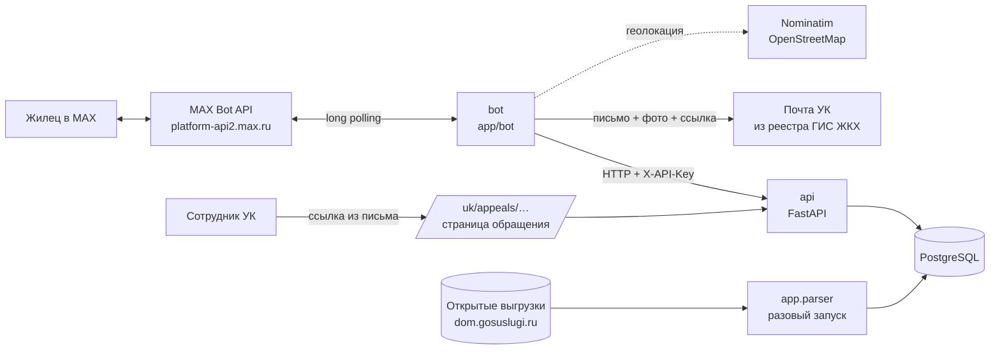

# Домовой — бот в MAX для жильцов многоквартирных домов

Хакатон MAX, трек «Умный город».

**Домовой** — чат-бот в мессенджере MAX. Он за пару минут отправляет обращение
жильца в *управляющую компанию его дома*: жильцу не нужно искать, кто обслуживает
дом и куда писать. Когда УК берёт обращение в работу или решает его, жилец
получает сообщение с её комментарием. Ещё бот заранее предупреждает об отключениях
воды и света по адресу.

| | |
|---|---|
| Бот в MAX | https://web.max.ru/387031056 |
| Репозиторий | https://github.com/rp3222079-byte/-hackathon_MAX_grajdanin |
| Команда | «Гражданин»: Попов Роман, Синьшинов Степан, Сенчурин Илья, Устюжанин Денис |
| Проверяемая версия | commit hash указан в презентации и форме сдачи |
| Собственный API | внутренний, для бота; наружу не публикуется (см. «Состав и архитектура») |

---

## Назначение

**Для кого:** жилец многоквартирного дома под управлением УК, у которого в доме
что-то сломалось: течёт труба, не работает лифт, не горит свет в подъезде.

**Проблема:** чтобы сообщить об этом официально, жилец должен выяснить, какая УК
обслуживает дом, найти её почту, составить письмо, а потом гадать, дошло ли оно
и что с ним происходит. Проще написать в домовой чат — и проблема не фиксируется.

**Решение:**

1. Жилец один раз указывает адрес: кнопками, текстом с подсказкой улиц
   или геолокацией.
2. Бот определяет УК дома по справочнику из открытых данных ГИС ЖКХ.
3. Обращение собирается кнопками: тема, текст, фото, контакт по желанию.
4. Бот отправляет письмо на официальную почту УК из реестра ГИС ЖКХ.
   В письме есть ссылка на страницу обращения.
5. УК на этой странице отмечает «В работе» или «Решено» с комментарием,
   и жилец сразу получает сообщение в MAX.

## Основной пользовательский сценарий

```
«Начать» ─► город (кнопка) ─► улица (с подсказкой при опечатке) ─► дом ─► квартира
          │   или «Отправить геолокацию» ─► «Да, всё верно» ─► квартира
          └─► «Адрес сохранён… Управляющая компания: УК «Сибирь», тел. …»

«Написать обращение» ─► «Обращение уйдёт в УК «Сибирь». О чём обращение?»
   ─► тема ─► описание (можно сразу с фото) ─► фото или «Без фото»
   ─► «Поделиться номером телефона» / «Только имя в MAX» / «Не указывать»
   ─► сводка с получателем ─► «Отправить»
   ─► «Обращение №DM-00001 принято. Отправляю…» ─► «…отправлено в УК «Сибирь»»

УК открывает ссылку из письма ─► «В работе» + комментарий
   ─► жилец: «Обращение №DM-00001 «Лифт»: в работе. Ответ УК: …»
```

Остальные пункты меню:

- **Мои обращения** — номера, даты, получатель, статус и ответ УК; для неотправленных
  есть кнопка «Повторить отправку».
- **Отключения** — ещё не закончившиеся отключения воды и света по основному адресу.
- **Мой адрес** — список адресов с УК, «Сделать основным», «Удалить», «Добавить адрес».
- **Настройки** — какие уведомления об отключениях присылать (вода / свет),
  за сколько часов предупреждать, выключить или включить все.
- **Помощь**, `/start`, «Отмена» и кнопки меню работают на любом шаге:
  начатый диалог прерывается, тупиков нет.

### Возможности MAX сверх текстового чата

| Возможность | Где | Зачем |
|---|---|---|
| Кнопка `request_geo_location` | ввод адреса | адрес по геолокации без набора текста |
| Кнопка `request_contact` | контакт в обращении | УК получает настоящий номер телефона, а не ник |
| Фото во вложениях | обращение | фото проблемы уходят в письмо УК |
| Правка сообщения по нажатию кнопки (`/answers`) | все кнопки | старая клавиатура исчезает, в истории остаётся выбранный вариант |
| Команды бота (`/me/commands`) | меню MAX | `/start`, `/help` |

## Состав и архитектура



| Компонент | Где | Что делает |
|---|---|---|
| **bot** | `app/bot/` | Приём событий MAX (long polling), диалоги, клавиатуры. В фоновых потоках отправляет письма в УК и раз в 30 секунд рассылает уведомления об отключениях и новых статусах обращений |
| **api** | `app/main.py`, `app/routers/` | Внутренний REST API: жильцы, адреса, справочник УК, отключения, обращения, очереди уведомлений. Страница обращения для УК. При старте применяет миграции и загружает тестовые данные |
| **db** | PostgreSQL 16 (в Docker), SQLite (локально) | Жильцы, адреса, УК и их дома, отключения, обращения, отметки об уведомлениях |
| **parser** | `app/parser/` | Сборка справочника УК и домов из открытых выгрузок ГИС ЖКХ, запускается вручную |

Как устроено:

- **Бот не обращается к базе напрямую**, только к API. Логика данных живёт
  в одном месте, бот — тонкий слой диалогов.
- **Кому и что отправить, решает API** (`/outages/notifications/pending`,
  `/appeals/updates/pending`). Бот только доставляет сообщения и ставит отметки.
  Отметки хранятся в БД, поэтому после перезапуска ничего не теряется
  и не дублируется.
- **Письмо отправляется в отдельном потоке.** Медленный SMTP не блокирует
  ответы другим жильцам: жилец сразу видит «принято, отправляю», а затем результат.
- **Незаконченные диалоги** хранятся в файле (`BOT_STATE_PATH`, том `botstate`)
  и переживают перезапуск бота.
- **API защищён ключом** `X-API-Key` (`API_TOKEN`). Страница УК открывается
  по подписанной ссылке (HMAC от номера обращения), а статус меняется только
  кнопкой (POST), так что почтовые сканеры ссылок ничего не изменят.

Структура кода:

```
app/
  main.py              FastAPI: роутеры, ключ API, ошибки, /docs, /health
  config.py            настройки API из окружения
  security.py          ключ API и подпись ссылок для УК
  timeutil.py          местное время города (TIMEZONE)
  db.py, migrations.py подключение к БД и миграции (применяются при старте)
  models.py, schemas.py таблицы и схемы API
  seed.py              тестовые данные
  routers/             users, addresses, outages, appeals, companies, uk (страница УК)
  services/
    addresses.py       нормализация улиц и корпусов, разбор «1-15, 12к2»
    directory.py       города, подсказка улиц, поиск УК по дому
    matching.py        задевает ли отключение адрес
    notifications.py   кому пора сообщить об отключении и о статусе
    appeals.py         номер обращения, получатель
    statuses.py        смена статуса
    mailer.py          письмо в УК: SMTP, outbox, перенаправление
  bot/
    main.py            long polling, разбор событий MAX
    handlers.py        сценарии диалогов
    workers.py         отправка писем и рассылка уведомлений (фоновые потоки)
    client.py          клиент MAX Bot API
    api.py             запросы бота к API
    geo.py             адрес по геолокации, контакт из vCard
    tls.py             сертификат Минцифры для platform-api2.max.ru
    states.py          состояние диалогов (файл)
    texts.py, keyboards.py  тексты и клавиатуры
  parser/              парсер ГИС ЖКХ
certs/                 корневой сертификат Минцифры (публичный)
data/companies.csv     тестовый справочник УК
docs/DATABASE.md       схема БД и миграции
tests/                 173 автотеста, в том числе сквозные сценарии бота
.github/workflows/     CI: тесты и проверка сборки Docker
```

## Запуск одной командой (Docker)

Нужны Docker с Compose v2 и токен бота MAX.

```bash
cp .env.example .env        # Windows: copy .env.example .env — и впишите MAX_BOT_TOKEN
docker compose up --build
```

`docker compose up --build` поднимает все локальные компоненты:

1. `db` — PostgreSQL;
2. `api` — применяет миграции, загружает тестовые данные (повторный запуск
   дублей не создаёт) и запускает API на http://localhost:8000;
3. `bot` — стартует, когда API прошёл проверку здоровья, и начинает отвечать в MAX.

Когда в логах появится `Бот запущен: …`, откройте бота в MAX и нажмите «Начать».
Сборка занимает около минуты: все зависимости ставятся готовыми пакетами.

### Остановка и повторный запуск

```bash
docker compose stop            # остановить, данные сохраняются
docker compose start           # запустить снова
docker compose restart bot     # перезапустить только бота (диалоги сохранятся)
docker compose down            # удалить контейнеры; база, письма и диалоги остаются в томах
docker compose down -v         # удалить и тома — следующий запуск с чистыми данными
docker compose up --build      # пересобрать после изменения кода
```

### Запуск без Docker (для разработки)

```bash
python -m venv .venv
source .venv/bin/activate          # Windows: .venv\Scripts\activate
pip install -r requirements.txt
cp .env.example .env               # впишите MAX_BOT_TOKEN
python -m app.seed                 # тестовые данные в SQLite domovoy.db
uvicorn app.main:app --port 8000   # терминал 1
python -m app.bot.main             # терминал 2
```

Python 3.12–3.14. `.env` читают и API, и бот.

## Переменные окружения

Шаблон — `.env.example`, рабочие значения — только в `.env` (он в `.gitignore`).

| Переменная | Обязательна | По умолчанию | Назначение |
|---|---|---|---|
| `MAX_BOT_TOKEN` | **да** | — | Токен бота MAX (business.max.ru → «Чат-боты» → «Интеграция») |
| `MAX_API_BASE_URL` | нет | `https://platform-api2.max.ru` | Адрес MAX Bot API по документации dev.max.ru |
| `API_TOKEN` | да, если API доступен извне | `local-dev-token-change-me` | Ключ бота к API (`X-API-Key`) и секрет подписи ссылок УК. Пусто — проверка выключена |
| `PUBLIC_BASE_URL` | нет | `http://localhost:8000` | Внешний адрес API: из него собирается ссылка для УК в письме |
| `API_PORT` | нет | `8000` | Порт API на хосте |
| `TIMEZONE` | нет | `Asia/Novosibirsk` | Часовой пояс города: время отключений и обращений |
| `API_BASE_URL` | нет | `http://localhost:8000` | Адрес API для бота. В Docker — `http://api:8000` |
| `DATABASE_URL` | нет | `sqlite:///./domovoy.db` | Строка подключения к БД. В Docker — PostgreSQL сервиса `db` |
| `BOT_STATE_PATH` | нет | `bot_state.json` | Файл незаконченных диалогов. В Docker — том `botstate` |
| `GEOCODER_URL` | нет | Nominatim OpenStreetMap | Геокодер для кнопки «Отправить геолокацию». Пусто — кнопки нет |
| `SMTP_DRY_RUN` | нет | `true` | `true` — письма сохраняются в `outbox/*.eml`, а не отправляются |
| `MAIL_REDIRECT_TO` | нет | — | Все письма уходят на этот адрес вместо почты УК (демонстрация) |
| `SMTP_HOST`, `SMTP_PORT` | при `SMTP_DRY_RUN=false` | —, `587` | SMTP-сервер; 465 — SSL, иначе STARTTLS |
| `SMTP_USER`, `SMTP_PASSWORD` | при `SMTP_DRY_RUN=false` | — | Почтовый ящик сервиса |
| `SMTP_FROM`, `SMTP_REPLY_TO` | нет | `SMTP_USER` | Отправитель и адрес для ответа |

## Порты

| Сервис | Порт | Зачем |
|---|---|---|
| `api` | `8000` → `8000` (`API_PORT`) | API, `/docs`, `/health` и страница обращения для УК |
| `db` | наружу не публикуется | PostgreSQL доступен только внутри сети compose |
| `bot` | нет входящих портов | сам опрашивает MAX (long polling), webhook не нужен |

## Зависимости

Python 3.12 (образ `python:3.12-slim`). Версии зафиксированы в `requirements.txt`:

- `fastapi`, `uvicorn[standard]`, `python-multipart` — API и форма страницы УК;
- `sqlalchemy`, `psycopg[binary]` — БД (PostgreSQL в Docker, SQLite локально);
- `pydantic`, `pydantic-settings`, `email-validator` — схемы и настройки;
- `requests`, `certifi` — клиент MAX Bot API, геокодер, скачивание фото;
- `httpx`, `beautifulsoup4`, `lxml` — парсер ГИС ЖКХ;
- `tzdata` — часовые пояса в slim-образе.

Внешние образы: `python:3.12-slim`, `postgres:16-alpine`.

## Внешние сервисы и интеграции

| Сервис | Для чего | Статус в MVP |
|---|---|---|
| **MAX Bot API** (`platform-api2.max.ru`) | сообщения, кнопки, вложения, команды | Реальная интеграция. Домен подписан сертификатом Минцифры: он лежит в `certs/` и подключается автоматически |
| **Открытые выгрузки ГИС ЖКХ** (dom.gosuslugi.ru) | справочник УК (название, ОГРН, почта, телефон) и домов под управлением | Реальный парсер `python -m app.parser`, запускается вручную (выгрузка домов ~3 ГБ). В демо — тестовый справочник |
| **SMTP** | письмо с обращением в УК | Реальная отправка при `SMTP_DRY_RUN=false`. Для проверки по умолчанию — `outbox/` |
| **OpenStreetMap Nominatim** | адрес по геолокации | Реальный открытый геокодер; жилец подтверждает результат. Отключается `GEOCODER_URL=` |
| **Источник отключений** | плановые отключения воды и света | **Не подключён.** Отключения смоделированы, бот помечает их «данные тестовые» |

Вне Docker для проверки нужны только MAX (токен бота и приложение или
web.max.ru) и доступ в интернет для геокодера.

## Работа с данными

| Данные | Источник | Тип |
|---|---|---|
| Жилец | `user_id` из MAX, создаётся при первом сообщении | реальные |
| Адрес | вводит жилец (или геолокация + подтверждение), сверяется со справочником | реальные |
| Справочник УК и домов | `data/companies.csv` — **тестовый**: 7 УК Новосибирска, 86 улиц, почты на `@example.ru`. Настоящий собирается парсером ГИС ЖКХ | тестовые / официальные |
| Отключения | `app/seed.py`: одно на каждую улицу справочника, время от момента запуска | **смоделированные** |
| Обращения | создаёт бот, номер `DM-00001` | реальные |

**Персональные данные.** Хранятся `user_id` в MAX, адреса (квартира — по желанию),
настройки уведомлений и обращения. Контакт (имя, ник или телефон) попадает
в обращение, только если жилец сам нажал соответствующую кнопку. Фото
не сохраняются на сервере: бот скачивает их из MAX и прикладывает к письму.

**Как определяется УК.** Улица нормализуется («ул. Ленина» = «улица Ленина» =
«Ленина», «ё» = «е»), корпус приводится к виду «к2» («корп. 2», «2К»).
Затем ищется дом в `company_houses`: сначала с тем же корпусом, потом
без учёта корпуса («12» и «12к2» — одна УК, «12к2» и «12к3» — разные).

**Статусы обращения:** `new` → `sent` / `failed` (ставит бот после письма)
→ `in_progress` → `resolved` (ставит УК на странице обращения). О статусах УК
жилец получает сообщение с комментарием.

**Уведомления об отключениях** приходят, когда до начала осталось не больше
«предупреждать за N часов» (по умолчанию 2) или отключение уже идёт. Учитываются
настройки воды и света, все адреса жильца. Каждое отключение приходит один раз.

### Сборка настоящего справочника УК из ГИС ЖКХ

```bash
python -m app.parser --city Новосибирск --out data/nsk          # скачать и собрать csv + json
python -m app.parser --city Новосибирск --out data/nsk --load   # и загрузить в базу
python -m app.parser --load data/nsk/novosibirsk.json           # загрузить готовый файл
```

Дома сопоставляются с УК по ОГРН. Почта берётся из реестра поставщиков
информации; если её нет, бот честно сообщает, что отправить письмо некуда.
В Docker: `docker compose exec api python -m app.parser --city Казань --out data/kazan --load`.

> **Внимание.** С настоящим справочником и `SMTP_DRY_RUN=false` письма уйдут
> в настоящие УК. Для демонстрации используйте `MAIL_REDIRECT_TO=ваш@адрес`:
> письма придут вам с пометкой, кому они предназначались.

## Тестовые данные

Загружаются автоматически при старте `api`. Вручную:

```bash
python -m app.seed               # справочник УК + демо-отключения
python -m app.seed --companies   # только справочник УК
python -m app.seed --clear       # удалить отключения и отметки об уведомлениях
```

В Docker: `docker compose exec api python -m app.seed --clear`, затем
`docker compose restart api`.

Адреса для проверки (город **Новосибирск**):

| Адрес | Что будет |
|---|---|
| ул. Ленина, 11 | УК «Сибирь»; вода отключится **через час** — уведомление придёт в течение минуты после ввода адреса |
| ул. Мира, 12к2 | УК «Сибирь»; свет отключён **сейчас**, дом с корпусом |
| «Ленена» вместо «Ленина» | бот предложит «улица Ленина» |
| ул. Ленина, 999 | «Дома 999 … нет в справочнике» — адрес не сохраняется |
| любая улица из `data/companies.csv` | есть УК и демо-отключение |

## Пошаговый сценарий проверки

1. `docker compose up --build` (или откройте бота по ссылке выше). Нажмите «Начать».
2. Нажмите **Новосибирск** → напишите `Ленена` → выберите **улица Ленина** →
   `11` → `5`. Бот покажет адрес и УК «Сибирь» с телефоном.
3. В течение минуты придёт «Внимание: по адресу … отключат воду».
4. **Отключения** — то же отключение с пометкой «данные тестовые».
5. **Написать обращение** → **Лифт** → `Лифт не работает третий день` (можно с фото)
   → **Без фото** → **Поделиться номером телефона** (или **Только имя в MAX**)
   → проверьте сводку → **Отправить**.
6. Придут два сообщения: «Обращение №DM-00001 принято. Отправляю…»
   и «…отправлено в УК «Сибирь»».
7. Письмо: `docker compose cp bot:/app/outbox ./outbox` → откройте `.eml`.
   Ссылка для УК есть в письме и в логе: `docker compose logs bot | grep "Страница для УК"`.
8. Откройте ссылку в браузере → **В работе** → комментарий `Мастер придёт завтра с 10 до 12`
   → **Сохранить**. В течение 30 секунд в MAX придёт «Обращение №DM-00001 «Лифт»:
   в работе. Ответ УК: …».
9. **Мои обращения** — статус «в работе» и ответ УК.
10. **Мой адрес** → **Добавить адрес** → `Мира` → `12к2` → **Без квартиры**:
    новый адрес станет основным, в «Мой адрес» можно вернуть прежний.
11. **Настройки** → **Изменить время** → **За 24 ч.**; **Вода: выключить**.
12. На любом шаге нажмите **Отмена** или кнопку меню — диалог прервётся без ошибок.

Без MAX API можно проверить через http://localhost:8000/docs (**Authorize**,
ключ из `API_TOKEN`).

## Примеры ожидаемого поведения

| Действие | Ответ бота |
|---|---|
| `/start` у нового жильца | «Здравствуйте! Я «Домовой»… В каком городе ваш дом?» + кнопки городов и геолокации |
| Город не из справочника | «Для города «Москва» справочника управляющих компаний пока нет. Сейчас я работаю в городах: Новосибирск» |
| Опечатка в улице | «Не нашёл точно «Ленена». Возможно, вы имели в виду…» + «улица Ленина» |
| Дома нет в справочнике | «Дома 999 на улице «улица Ленина» нет в справочнике…», шаг повторяется |
| Адрес сохранён | «Адрес сохранён и выбран основным… Управляющая компания: УК «Сибирь», тел. …» |
| «Протечка» | подсказка позвонить в УК по телефону, если ситуация аварийная |
| «Отправить» | «Обращение №DM-00001 принято. Отправляю в УК «Сибирь»…», затем «…отправлено» |
| Почта недоступна | «Не получилось отправить обращение №…: почтовый сервер не ответил» + «Повторить отправку» |
| УК отметила «Решено» | «Обращение №DM-00001 «Лифт»: решено. Ответ УК: …» |
| Кнопка меню посреди диалога | диалог прерывается, выполняется выбранный пункт |
| Длинный текст вне диалога | «Похоже, вы хотите сообщить о проблеме. Нажмите «Написать обращение»…» |
| API недоступен | «Что-то пошло не так на нашей стороне…», бот продолжает работать, начатый диалог сохраняется |
| Чужая или подделанная ссылка УК | страница «Ссылка недействительна» (403) |

## Тесты

```bash
python -m unittest discover -s tests -t .
```

173 теста: сквозные сценарии бота на настоящем API с базой в памяти
(адрес, геолокация, обращение с фото и телефоном, повторная отправка,
уведомления, настройки), API и его ошибки, окно уведомлений, страница УК
и подпись ссылок, ключ API, справочник и подсказка улиц, миграции,
разбор адресов, письмо, парсер ГИС ЖКХ.

CI (`.github/workflows/ci.yml`) при каждом пуше гоняет тесты, собирает образы,
поднимает `db` и `api` через `docker compose` и проверяет API и TLS-соединение
контейнера бота с `platform-api2.max.ru`.

## Известные ограничения

- **Отключения смоделированы.** Реальный источник не подключён: у поставщиков
  нет единого открытого API. Бот помечает такие данные как тестовые.
- **Тестовый справочник УК только для Новосибирска.** Для другого города нужен
  запуск парсера ГИС ЖКХ.
- **Страница УК без учётных записей.** Доступ — по подписанной ссылке из письма:
  у кого письмо, тот и отвечает. Кабинет УК с входом — следующий шаг.
- **Геолокация зависит от OpenStreetMap:** у части домов в OSM нет номера,
  тогда бот спросит номер дома сам.
- **Фото хранятся только в письме.** При повторной отправке после перезапуска
  бота фото не прикладываются (жилец увидит пометку).
- **Кнопки контакта и геолокации** работают в клиентах MAX, которые их поддерживают.
  Если MAX их не примет, бот отправит клавиатуру без них.

## Что дальше

- Подключение реального источника отключений (парсер сайтов РСО или договор с диспетчерской).
- Кабинет УК в мини-приложении MAX: список обращений, фильтры, сроки.
- Обращения через MAX-канал УК (по ПП РФ № 40) вместо почты, когда УК подключится.
- Сроки ответа и напоминания УК о просроченных обращениях.
- Миграции Alembic, метрики пилота (время подачи, доля завершивших сценарий).
